# 🛡️ Enterprise Service Governance Catalog

[](https://enterprise-service-governance-catalog-kw.streamlit.app/)


**Enterprise Cloud Governance • Python • Streamlit • NIST CSF • Risk Management • Executive Reporting**

---

## 🚀 Live Demo

Explore the deployed application:

**[Open the Enterprise Service Governance Catalog](https://enterprise-service-governance-catalog-kw.streamlit.app/)**

---

## Executive Summary

The **Enterprise Service Governance Catalog** is a simulated enterprise governance platform that demonstrates how Cloud Governance, Enterprise Architecture, Cybersecurity, and Risk teams evaluate cloud services before they are approved for production use.

Rather than focusing on infrastructure deployment, this project focuses on the governance process that determines whether a cloud service should be approved, rejected, or remediated before implementation.

This portfolio project was inspired by real enterprise Cloud Governance workflows and showcases how governance teams document approvals, map security controls, evaluate risk, validate evidence, and provide executive decision support.

---

## Business Problem

Large organizations often support hundreds of cloud services across AWS, Azure, and Google Cloud.

Without standardized governance:

- Duplicate reviews occur
- Approvals become inconsistent
- Architecture decisions lack documentation
- Security controls become difficult to verify
- Executive reporting requires manual effort
- Audit preparation becomes time-consuming

This project demonstrates how governance teams can centralize those activities within a single operational platform.

---

## Solution

This application provides an enterprise-style governance portal capable of:

- Managing an enterprise cloud service inventory
- Tracking governance readiness
- Evaluating governance scores
- Mapping security controls
- Recording architecture approvals
- Tracking Cloud Architecture Decision Approval, or CADA
- Reviewing governance evidence
- Supporting executive decision-making
- Generating downloadable executive governance reports
- Capturing governance intake submissions

---

## 🏗️ Enterprise Cloud Governance Workflow

The diagram below illustrates the governance process this application was designed to simulate. It represents how a cloud service request progresses from business submission through architecture review, governance validation, security control mapping, risk assessment, and executive approval.

```mermaid
flowchart LR

    subgraph BusinessUnit["Business Unit"]
        A["Submit Cloud Service Request"]
        B["Document Business Need and Intended Use"]
    end

    subgraph GovernanceTeam["Cloud Governance and Architecture"]
        C["Governance Intake"]
        D["Enterprise Architecture Review"]
        E["Cloud Architecture Decision Approval - CADA"]
        F["Governance Evidence Validation"]
        G["Security Control Mapping"]
        H["Risk Assessment"]
    end

    subgraph ExecutiveBoard["Executive Governance Decision"]
        I{"Governance Decision"}
        J["Approved for Production"]
        K["Remediation Required"]
        L["Rejected"]
    end

    A --> B
    B --> C
    C --> D
    D --> E
    E --> F
    F --> G
    G --> H
    H --> I

    I -->|Approve| J
    I -->|Remediate| K
    I -->|Reject| L

    K --> F

    style A fill:#D6EAF8,stroke:#2E86C1,color:#000000
    style B fill:#D6EAF8,stroke:#2E86C1,color:#000000
    style C fill:#EBF5FB,stroke:#2E86C1,color:#000000
    style D fill:#EBF5FB,stroke:#2E86C1,color:#000000
    style E fill:#EBF5FB,stroke:#2E86C1,color:#000000
    style F fill:#FCF3CF,stroke:#B7950B,color:#000000
    style G fill:#FCF3CF,stroke:#B7950B,color:#000000
    style H fill:#FADBD8,stroke:#CB4335,color:#000000
    style I fill:#E8DAEF,stroke:#7D3C98,color:#000000
    style J fill:#D5F5E3,stroke:#239B56,color:#000000
    style K fill:#FDEBD0,stroke:#CA6F1E,color:#000000
    style L fill:#F5B7B1,stroke:#CB4335,color:#000000
```



### Workflow Logic

1. A business unit submits a cloud service request and documents the intended use and business need.
2. The Cloud Governance team performs intake and determines whether the request is ready for formal review.
3. Enterprise Architecture evaluates alignment with enterprise technology standards.
4. The cloud architecture is evaluated through the CADA process.
5. Required governance evidence is reviewed for completeness.
6. Security requirements are mapped to NIST CSF, NIST SP 800-53, and CIS Controls.
7. The service receives a risk assessment based on its architecture, evidence, controls, and intended use.
8. Leadership makes a final governance decision to approve, require remediation, or reject the request.
9. Requests requiring remediation return to evidence validation before being reviewed again.

---

## Dashboard Features

### Executive Dashboard

Monitor governance posture across the enterprise, including:

- Governance KPIs
- Risk distribution
- Cloud provider summaries
- Governance readiness
- Executive metrics

### Service Inventory

Search and filter services by:

- Cloud Provider
- Approval Status
- Risk Level
- Governance Readiness
- Risk Acceptance

### Individual Service Profile

Each service contains:

- Approval Status
- Governance Score
- Evidence Completion
- Risk Rating
- Review Timeline
- Governance Decision
- Action Owner
- Review Dates

### Governance Timeline

Visual representation of governance stages:

1. Intake
2. Enterprise Architecture Review
3. Cloud Architecture Decision Approval
4. Evidence Validation
5. Risk and Control Review
6. Governance Decision

### Governance Decision Package

Every service automatically generates an executive-ready governance narrative that includes:

- Business Need
- Decision Rationale
- Security Benefits
- Residual Risks
- Required Evidence
- Final Governance Decision

### Governance Evidence Checklist

Track required documentation, including:

- Architecture approval
- CADA approval
- Service owner
- Review schedule
- Approved capabilities
- Required controls
- Governance decision
- Recommended actions

### Security Control Mapping

Maps required controls against:

- NIST Cybersecurity Framework 2.0
- NIST Special Publication 800-53
- CIS Controls

This demonstrates how governance decisions can be aligned with recognized cybersecurity frameworks and control libraries.

### Executive PDF Reporting

Generate downloadable executive governance summaries containing:

- Governance decision
- Risk assessment
- Control mappings
- Evidence summary
- Security rationale
- Executive recommendation

### Governance Intake Portal

Includes a simulated governance request form allowing users to submit:

- Business Unit
- Requested Service
- Cloud Provider
- Intended Use
- Business Justification
- Required Integrations
- Risk Questions

Each submission produces a governance request JSON package representing what might be submitted to an enterprise governance team.

---

## 📸 Application Walkthrough

### Executive Dashboard


---

### Service Inventory


---

### Individual Service Profile


---

### Governance Timeline


---

### Governance Evidence Checklist


---

### Security Control Mapping


---

### Governance Decision Package


---

### Governance Intake Portal


---

### Governance Submission JSON


---

### Executive PDF Report


---

### Leadership Exceptions Dashboard


---

## Technology Stack

### Application Development

- Python
- Streamlit
- Pandas
- Plotly
- ReportLab
- JSON
- CSS

### Governance and Security Frameworks

- NIST Cybersecurity Framework 2.0
- NIST Special Publication 800-53
- CIS Controls

### Development and Deployment

- Git
- GitHub
- Streamlit Community Cloud

---

## Repository Structure

```text
enterprise-service-governance-catalog/
│
├── app/
│   └── app.py
│
├── data/
│
├── docs/
│   └── screenshots/
│       ├── 01-dashboard.png
│       ├── 02-service-inventory.png
│       ├── 03-service-profile.png
│       ├── 04-governance-timeline.png
│       ├── 05-evidence-checklist.png
│       ├── 06-control-mappings.png
│       ├── 07-decision-package.png
│       ├── 08-intake-form.png
│       ├── 09-submission-json.png
│       ├── 10-executive-pdf.png
│       └── 11-leadership-exceptions.png
│
├── scripts/
│
├── README.md
└── requirements.txt
```

---

## Future Enhancements

- Authentication
- Role-Based Access Control
- Microsoft Entra ID integration
- ServiceNow integration
- Jira integration
- Automated approval workflows
- Power BI executive reporting
- SQL database backend
- Audit export
- Risk trending
- Centralized control library
- Evidence repository

---

## Disclaimer

This project is intended solely as a portfolio demonstration.

All services, approvals, architecture decisions, governance data, and risk information are fictional and generated for educational and demonstration purposes.

No confidential, proprietary, or employer-specific enterprise information is included.

---

## Author

**Kareem Watts**

Technical Business Analyst  
Cloud Governance  
Cybersecurity Governance  
Python Automation  
Streamlit  

**GitHub Portfolio:** [github.com/reemdadreem](https://github.com/reemdadreem)

