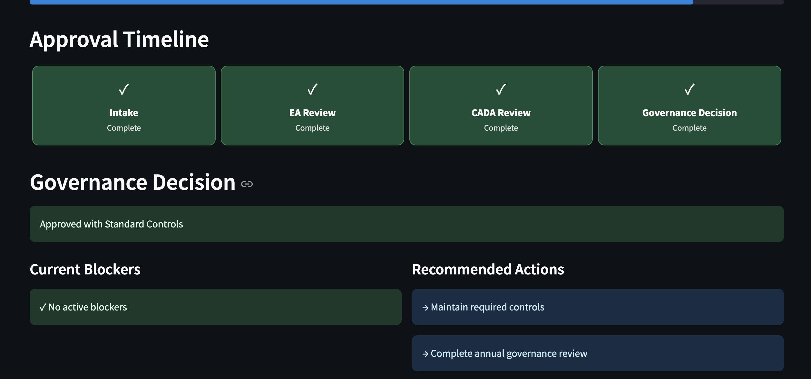
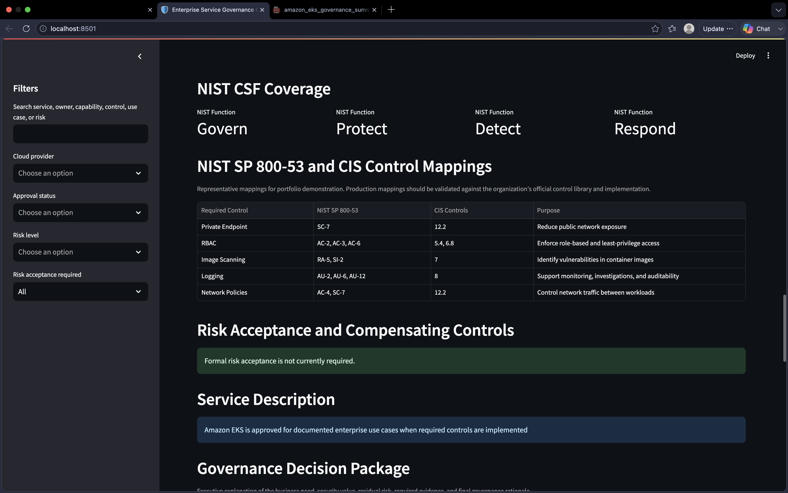

# 🛡️ Enterprise Service Governance Catalog

> Enterprise Cloud Governance • Python • Streamlit • NIST CSF • Risk Management • Executive Reporting

---

## Executive Summary

The Enterprise Service Governance Catalog is a simulated enterprise governance platform that demonstrates how Cloud Governance, Enterprise Architecture, Security, and Risk teams evaluate cloud services before they are approved for production use.

Rather than focusing on infrastructure deployment, this project focuses on the governance process that determines **whether a cloud service should be approved, rejected, or remediated** before implementation.

This portfolio project was inspired by real enterprise Cloud Governance workflows and showcases how governance teams document approvals, map security controls, evaluate risk, and provide executive decision support.

---

# Business Problem

Large organizations often support hundreds of cloud services across AWS, Azure, and Google Cloud.

Without standardized governance:

- duplicate reviews occur
- approvals become inconsistent
- architecture decisions lack documentation
- security controls become difficult to verify
- executive reporting requires manual effort
- audit preparation becomes time consuming

This project demonstrates how governance teams can centralize those activities into a single operational dashboard.

---

# Solution

This application provides an enterprise-style governance portal capable of:

- Managing enterprise cloud service inventory
- Tracking governance readiness
- Evaluating governance scores
- Mapping security controls
- Recording architecture approvals
- Tracking CADA approvals
- Reviewing evidence
- Supporting executive decision making
- Generating downloadable executive governance reports
- Capturing governance intake submissions

---

# Dashboard Features

## Executive Dashboard

Monitor governance posture across the enterprise.

- Governance KPIs
- Risk distribution
- Cloud provider summaries
- Governance readiness
- Executive metrics

---

## Service Inventory

Search and filter services by

- Cloud Provider
- Approval Status
- Risk Level
- Governance Readiness
- Risk Acceptance

---

## Individual Service Profile

Each service contains:

- Approval Status
- Governance Score
- Evidence Completion
- Risk Rating
- Review Timeline
- Governance Decision
- Action Owner
- Review Dates

---

## Governance Timeline

Visual representation of governance stages

✅ Intake

↓

✅ Enterprise Architecture Review

↓

✅ Cloud Architecture Decision Approval (CADA)

↓

✅ Governance Decision

---

## Governance Decision Package

Every service automatically generates an executive-ready governance narrative including

- Business Need
- Why the decision was made
- Security Benefits
- Residual Risks
- Required Evidence
- Final Governance Decision

---

## Governance Evidence Checklist

Track required documentation including

- Architecture approval
- CADA approval
- Service owner
- Review schedule
- Approved capabilities
- Required controls
- Governance decision
- Recommended actions

---

## Security Control Mapping

Maps required controls against

- NIST CSF
- NIST SP 800-53
- CIS Controls

to demonstrate governance alignment.

---

## Executive PDF Reporting

Generate downloadable executive governance summaries including

- Governance decision
- Risk assessment
- Control mappings
- Evidence summary
- Security rationale
- Executive recommendation

---

## Governance Intake Portal

Includes a simulated governance request form allowing users to submit:

- Business Unit
- Requested Service
- Cloud Provider
- Intended Use
- Business Justification
- Required Integrations
- Risk Questions

Each submission produces a governance request JSON package representing what might be submitted to an enterprise governance team.

---

# Screenshots

## Executive Dashboard


---

## Service Inventory


---

## Service Profile


---

## Governance Timeline



---

## Governance Evidence


---

## Security Control Mapping



---

## Governance Decision Package


---

## Governance Intake


---

## Governance Submission JSON


---

## Executive PDF


---

## Leadership Exceptions Dashboard


---

# Technology Stack

- Python
- Streamlit
- Pandas
- Plotly
- ReportLab
- JSON
- CSS
- NIST CSF 2.0
- NIST SP 800-53
- CIS Controls

---

# Repository Structure

```
enterprise-service-governance-catalog/

app/
data/
docs/
scripts/

README.md
requirements.txt
```

---

# Future Enhancements

- Authentication
- Role Based Access Control
- Azure AD Integration
- ServiceNow Integration
- Jira Integration
- Approval Workflows
- Power BI Executive Reporting
- SQL Backend
- Audit Export
- Risk Trending
- Control Library
- Evidence Repository

---

# Disclaimer

This project is intended solely as a portfolio demonstration.

All services, approvals, architecture decisions, governance data, and risk information are fictional and generated for educational and demonstration purposes.

No confidential or proprietary enterprise information is included.

---

# Author

**Kareem Watts**

Technical Business Analyst

Cloud Governance

Cybersecurity Governance

Python Automation

Streamlit

GitHub Portfolio
